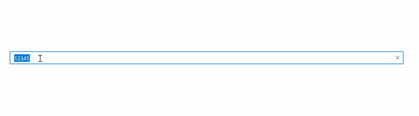

# How-to-select-all-the-current-value-on-focus-in-Xamarin.Forms-SfMaskedEdit

This article explains how to select all the text on focus in Xamarin.Forms SfMaskedEdit with the following steps.
  
**Step 1:** Create an extended SfMaskedEdit control to introduce the property to get the select all on focus support even in dynamically. 

[C#]
```
public class ExtMaskedEdit : SfMaskedEdit
    {
        public bool SelectAllOnFocus
        {
            get { return (bool)GetValue(SelectAllOnFocusProperty); }
            set { SetValue(SelectAllOnFocusProperty, value); }
        }
        public static readonly BindableProperty SelectAllOnFocusProperty =
            BindableProperty.Create("SelectAllOnFocus", typeof(bool), typeof(ExtMaskedEdit), false);
    }
```
Step 2: Define the created custom masked edit control in your UI as per in the below code snippet.
```
[XAML]
<StackLayout>
        <local:ExtMaskedEdit Mask="00000" 
                           SelectAllOnFocus ="True"
                           Value="12345" 
                           VerticalOptions="Center"/>
 </StackLayout>
```
**Step 3:** Since don’t have a direct support to achieve it, need to achieve through custom renderer usage with platform specific
 
**Android: CustomRenderer.cs
 
As per your need, you can pass the flag value from SelectAllOnFocus property from Xamarin extended masked edit in SetSelectAllOnFocus method.
 ```
[C#]
public class CustomRenderer : SfMaskedEditRenderer
    {
        protected override void OnElementChanged(ElementChangedEventArgs<SfMaskedEdit> e)
        {
            base.OnElementChanged(e);
            if(Control != null)
            {
                Control.SetSelectAllOnFocus((Element as ExtMaskedEdit).SelectAllOnFocus);
            }
        }
        protected override void OnElementPropertyChanged(object sender, PropertyChangedEventArgs e)
        {
            base.OnElementPropertyChanged(sender, e);

            if(e.PropertyName.Equals("SelectAllOnFocus"))
            {
                Control.SetSelectAllOnFocus((Element as ExtMaskedEdit).SelectAllOnFocus);
            }
        }
    }

```
**iOS: CustomRenderer.cs
 
By calling the PerformSelector method to select all the value in iOS.
 ```
[C#]
  public class CustomRenderer : SfMaskedEditRenderer
    {
        protected override void OnElementChanged(ElementChangedEventArgs<SfMaskedEdit> e)
        {
            base.OnElementChanged(e);
            if(Control != null)
            {
                Control.EditingDidBegin += Control_EditingDidBegin;
            }
        }

        private void Control_EditingDidBegin(object sender, EventArgs e)
        {
            if((Element as ExtMaskedEdit).SelectAllOnFocus)
            Control.PerformSelector(new ObjCRuntime.Selector("selectAll"), null, 0.0f);
        }
    }
```

**UWP: CustomRenderer.cs
 
In the Focused event of the SfMakedEditExt, call the SelectAll method to achieve this requirement in UWP.
 ```
[C#]
public class CustomRenderer : SfMaskedEditRenderer
    {
        ExtMaskedEdit sfMaskedEditExt;
        protected override void OnElementChanged(ElementChangedEventArgs<Syncfusion.XForms.MaskedEdit.SfMaskedEdit> e)
        {
            base.OnElementChanged(e);
            sfMaskedEditExt = e.NewElement as ExtMaskedEdit;
            sfMaskedEditExt.Focused += SfMaskedEditExt_Focused;
          
        }

        private void SfMaskedEditExt_Focused(object sender, Xamarin.Forms.FocusEventArgs e)
        {
            if (Control != null && sfMaskedEditExt.SelectAllOnFocus)
            {
                Control.SelectAll();
            }
        }
    }
```

# Output: 



# See also

[What are mask types in SfMaskedEdit](https://help.syncfusion.com/xamarin/masked-entry/masktype)

[How to hide the prompt character](https://help.syncfusion.com/xamarin/masked-entry/hiding-prompt-characters)

[How to hide the clear button in SfMaskedEdit](https://help.syncfusion.com/xamarin/masked-entry/basic-features#clear-button-visibility)


